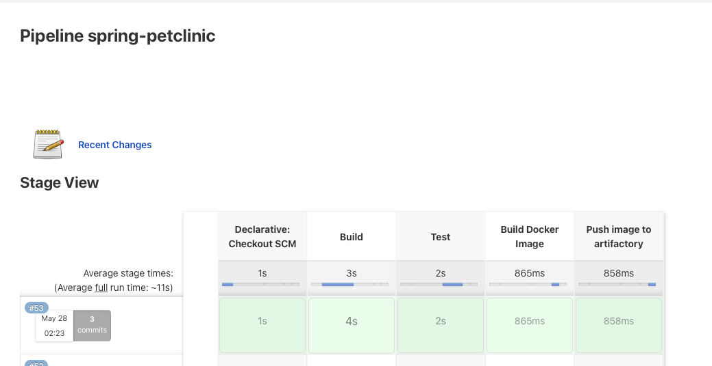

# Getting Started

### Spring Boot Pet Clinic app
### Deliverables
* GitHub repo
  * https://github.com/prahul/spring-petclinic-modified
* Jenkinsfile within that repo
  * Please refer to the Jenkinsfile at the root of the project
* Docker file within that repo
  * Please refer to the Dockerfile at the root of the project
* readme.md file
* Runnable docker image
  * Please pull the image using the following commad..
    * $ docker pull rahulpriyadarshi/spring-petclinic:0.1
### Prerequisites to run the app
* Install Docker: https://docs.docker.com/desktop/mac/install/
* Install Alpine Jenkins: https://github.com/liatrio/alpine-jenkins
  * Enable Docker usage: docker run -p 8080:8080 -v /var/run/docker.sock:/var/run/docker.sock liatrio/jenkins-alpine
* Install Intellij community: https://www.jetbrains.com/idea/download/#section=mac
### Create a docker image for the app
* Clone the app from the GitHub
  * $ git clone https://github.com/prahul/spring-petclinic.git
* Clean a build your project
  * cd <project toot directory>
  * ./gradlew clean build
* Create the docker image
  * $ docker build -t spring-petclinic .
  * $ docker images
* Run the app
  * $ docker run -p 8080:8080 spring-petclinic
  * Open a browser: http://localhost:8080
### Configure and run Jenkins pipeline
* Login to Jenkins. Make sure no other app is running on port 8080
  * http://localhost:8080
  * Go to Dashboard -> New Item
    * Give a name to your app "spring-petclinic-modified"
  * Select Pipeline
    * **Definition**: Pipeline Script from SCM
    * **SCM**: Git
    * **Repositories/Repository URL** : https://github.com/prahul/spring-petclinic
    * **Branched to build/Branch Specifier** : */main
    * **Script path**: Jenkinsfile
  * Save the configurations
  * Click on **Build Now** and your pipeline stages will build. The stages will look like below.
  
### Pushing image to artifactory
* Create an artifactory cloud account
* $ docker login <server-name>.jfrog.io
* $ docker tag spring-petclinic <server-name>/spring-petclinic
* $ docker push <server-name>.jfrog.io/spring-petclinic
### Pushing image to DockerHub
* $ docker login
* $ docker tag spring-petclinic rahulpriyadarshi/spring-petclinic:0.1
* $ docker push rahulpriyadarshi/spring-petclinic:0.1
### Improvements
* Create a start.sh script which will do all the setup without any manual work
* Add gradle plugin to create the docker image from Jenkins pipeline
* Add gradle plugin to push the image to artifactory
* Additional automation/compliance checks in the pipeline
